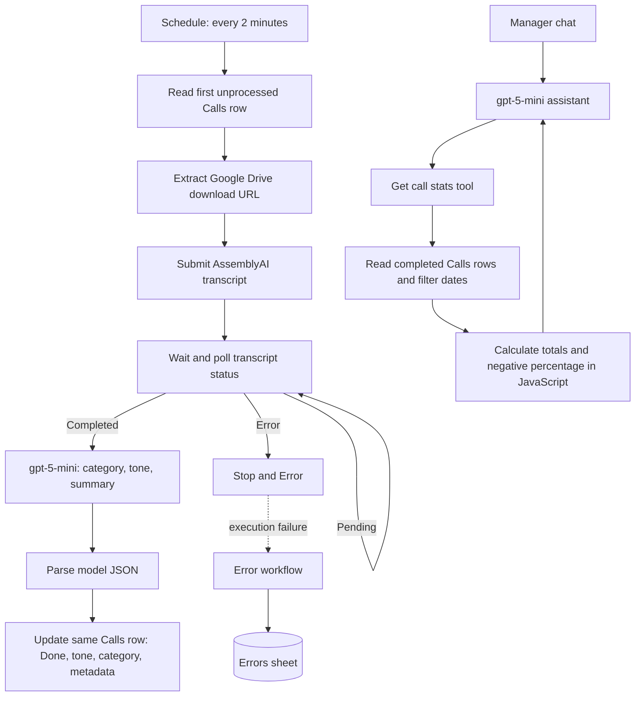

# CallInsight AI

**AI-assisted call analysis and conversational reporting, built with n8n, AssemblyAI and `gpt-5-mini`.**

CallInsight turns a queue of call recordings into categorized, sentiment-labelled records that a manager can query through a chat assistant. It combines audio processing with a deterministic statistics tool: JavaScript counts the calls; the assistant explains the returned numbers.

**Educational demonstration prototype, not a client deployment.** The confectionery-and-delivery scenario assumes **30–40 customer calls per day, two customer-service managers and one supervisor**. These describe the scenario, not measured throughput or staffing at a real customer.

## Business problem

Listening to every recording and compiling reports manually makes recurring delivery or product issues harder to spot. This prototype demonstrates a route from queued recordings to searchable call metrics, with an error log separated from the operational queue.

## Architecture

The transcription polling loop is represented as one stage. The source has no explicit polling limit or row lock; see [limitations](docs/LIMITATIONS.md).

## Included workflows

| Export | Purpose | Nodes |
| --- | --- | ---: |
| [Audio queue](workflows/audio-queue.json) | Process one blank-status row, transcribe, analyze and update it | 14 |
| [Audio assistant](workflows/audio-assistant.json) | Answer Ukrainian-language statistics questions using a workflow tool | 4 |
| [Call statistics](workflows/call-stats.json) | Filter completed rows by processing date and calculate metrics | 4 |
| [Error handler](workflows/error-handler.json) | Append execution time and error text to a separate sheet | 2 |

**24 nodes across four workflows.** Both OpenAI nodes use `gpt-5-mini`; the original Ukrainian prompts and four embedded JavaScript nodes are retained.

## What the prototype produces

- Category and tone stored on the original queue row, alongside `Done`, processing time, duration and word count.
- Total completed calls, negative calls and a rounded negative-call percentage for a requested processing-date range.
- A concise Ukrainian-language answer from a manager-facing assistant.
- An error-sheet entry when the queue workflow fails and its error-workflow binding is configured.

The analysis parser also produces a short summary, but the source does **not** map it into Google Sheets. Cost columns contain source heuristic estimates, not verified API billing. The output parser is prompt-based `JSON.parse`, not schema-enforced output.

## Evidence and validation

The [portfolio case](https://app.notion.com/p/39d7a4cb52cc81d985e8c780daf6e798) reports an under-three-minute demonstration run. Original execution logs and timing samples were not supplied for this repository, so that timing is not presented as a reproduced benchmark or service-level guarantee.

**40 offline checks passed, 0 failed.** They cover export integrity, original Code-node behavior, date-range statistics and documented failure modes. They do not establish transcription/model accuracy, supported throughput or successful live API execution.

## Getting started

1. Follow the [setup guide](docs/SETUP.md): import the four inactive exports, reconnect credentials and replace resource/workflow placeholders.
2. Use the [synthetic queue rows](examples/queue-rows.json) and [model-output example](examples/analysis-response.json).
3. Run `npm test` with Node.js 22 or newer; no dependencies or external API calls are required.
4. Complete the separate live checks in [validation](docs/VALIDATION.md) before any real use.

All public exports are inactive. Public chat is disabled in the sanitized assistant export. Eight credential bindings and private service/workflow identifiers were removed. Your original files are not included.

## Walkthrough and contact

- [Loom demonstration — Ukrainian narration](https://www.loom.com/share/e11fa54e25fc408fab3450a7f1153d13)
- [AI Automation portfolio](https://vladyslav-ai-automation.notion.site/AI-Automation-Portfolio-3917a4cb52cc81408f7cebb09a5d14ce)
- [Vladyslav Moskalkov on LinkedIn](https://www.linkedin.com/in/vladyslav-moskalkov/)

See [security notes](SECURITY.md) before connecting audio or personal data. No open-source license has been selected.
